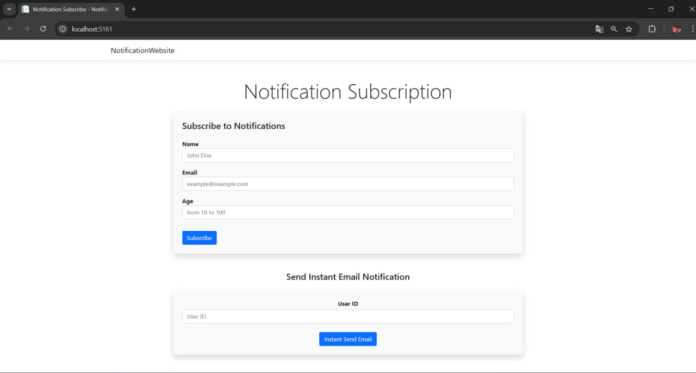
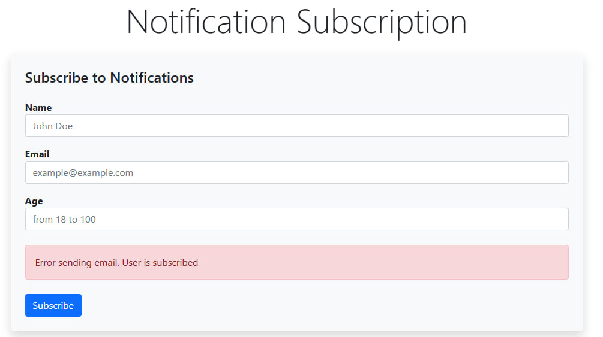
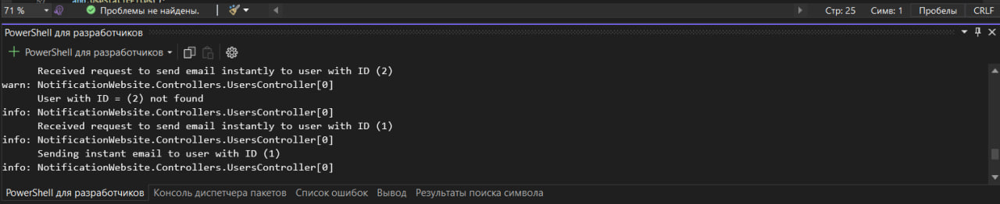
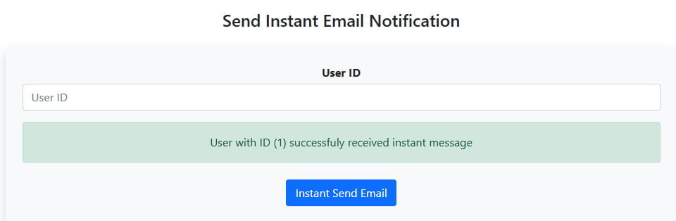

# NotificationWebsite

## This project was developed as a test assignment as part of the selection for an internship

**Implement a web application on ASP .NET Core that allows creating users in the application with subsequent automatic sending of emails to users on a schedule.**

### The application must read parameters from the json file of the application settings.

**The parameters must specify:**
  * Task execution schedule as a cron expression
  * Path to the folder with email templates

**The application must contain a background service that will perform the following procedure with a specified schedule:**
  * Get a list of emails of application users
  * Send an email to all users using a specified template

Within the application, it is also necessary to implement a REST API for saving users with the following endpoint:
POST /api/users - creating a new user

## The request body must contain email, name and age.

**Email validation:**
  * Compliance with email format
  * Uniqueness within the application

**Name validation:**
  * Name length must not exceed 20 characters
  * Cannot be null

**Age validation:**
  * Age must be between 18 and 100 years old

## The application must send a welcome email upon registration.

**The application must support at least 2 email templates:**
 * Welcome email
 * Informational email

**Ability to insert variables into the template (username, email, etc.) 
The User model must contain the following fields:**
  * Id – unique user identifier
  * Email – email
  * Name – username
  * Age – age
  * Timestamp – Creation date (in UTC format)

Storage all users in the InMemory Database. 

## Requirements:
  * .NET 8 platform
  * Application type - web application with REST API
  * Support for Windows and Linux-style paths
  * The application must have at least 2 email templates
  * User creation must be validated
  * The application must correctly handle errors that occur during operation, displaying understandable messages to the user. If an error occurs while sending a message to the mail, the program must process and display the error, and then wait for the next attempt according to the schedule

## Additional conditions of the task:
  * Implement logging in the application using the standard ILogger mechanism:
  * Error logging
  * Request logging
  * Logging the progress of sending mail
  * Logging the process of creating a user
  
  
**Implement receiving a list of users, as well as sending a POST request to send a letter along the path:**
 - POST /api/users/{id}/email
 - When sending a letter via a request, it is sent to the user's mail instantly, without waiting

## Examples of letters:
The content of the letter when creating a new user in the system: 
- Welcome to our system {{Name}}
- Your email {{Email}}
- Random image from the Internet (you can use https://http.cat/{status_code}, with any existing status code)

Contents of the information letter:
- We inform you {{Name}}
- Time passed since the user was created: {{ Time }}
- Random image from the Internet (you can use https://http.dog/{status_code}.jpg, with any existing status code)
Where Time is the calculated time unit of the difference, the current DateTime and Timestamp in utc

